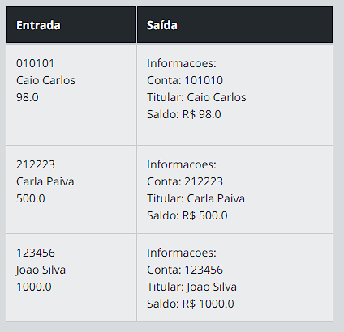
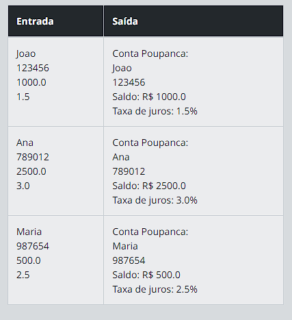
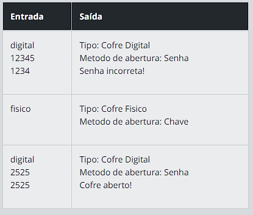
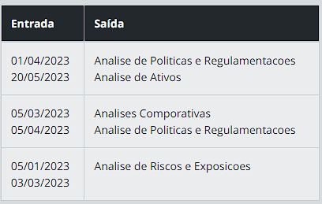
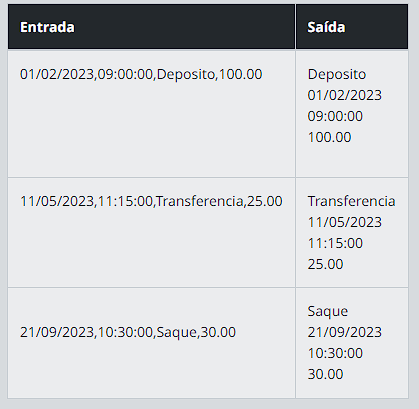

# dominio-bancario

## DESAFIO 1 - Abrindo Contas 🧾

<h3><strong>Desafio</strong></h3>

Você é um desenvolvedor em início de carreira e foi contratado por um banco para criar um sistema básico de abertura de contas. Sua tarefa é implementar uma classe chamada "ContaBancaria" que represente uma conta bancária com as seguintes informações: número da conta, nome do titular e saldo.

<h3><strong>Entrada</strong></h3>
O programa deve solicitar ao usuário as informações necessárias para abrir uma conta bancária. A entrada deve ser feita via console (linha de comando) e deve incluir o número da conta (um valor inteiro), o nome do titular (uma sequência de caracteres) e o saldo inicial da conta (um valor decimal).

<h3><strong>Saída</strong></h3>
Após receber as informações da conta, o programa deve criar um objeto do tipo "ContaBancaria" e exibir na tela as informações dessa conta, incluindo o número da conta, o nome do titular e o saldo atual. A saída deve ser formatada de forma clara e legível para o usuário.

Exemplos
A tabela abaixo apresenta exemplos com alguns dados de entrada e suas respectivas saídas esperadas. Certifique-se de testar seu programa com esses exemplos e com outros casos possíveis.

 

## DESAFIO 2 - Herança Bancária 💸

<h3><strong>Desafio</strong></h3>

Após o sucesso no desenvolvimento do sistema básico de abertura de contas bancárias, o banco decidiu expandir seus serviços para oferecer diferentes tipos de contas. Agora, além das contas bancárias comuns, eles também oferecem contas poupança. Sua tarefa é implementar a herança e o polimorfismo no sistema, criando uma classe "ContaPoupanca" que herde da classe "ContaBancaria" anteriormente criada. A classe "ContaPoupanca" deve adicionar um novo atributo, taxa de juros, além dos atributos herdados.

Dica: Utilize a herança para criar a classe "ContaPoupanca" que herde da classe "ContaBancaria" e adicione o atributo "taxaJuros". Implemente o método "exibirInformacoes()" na classe "ContaPoupanca" para exibir as informações adicionais.

<h3><strong>Entrada</strong></h3>
O programa deve solicitar ao usuário as informações necessárias para abrir uma conta poupança. A entrada deve ser feita via console (linha de comando) e deve incluir o número da conta (um valor inteiro), o nome do titular (uma sequência de caracteres), o saldo inicial da conta (um valor decimal) e a taxa de juros da conta poupança (um valor decimal).

<h3><strong>Saída</strong></h3>
Após receber as informações da conta poupança, o programa deve criar um objeto do tipo "ContaPoupanca" e exibir na tela as informações dessa conta, incluindo o número da conta, o nome do titular, o saldo atual e a taxa de juros. A saída deve ser formatada de forma clara e legível para o usuário.

<h3><strong>Exemplos</strong></h3>
A tabela abaixo apresenta exemplos com alguns dados de entrada e suas respectivas saídas esperadas. Certifique-se de testar seu programa com esses exemplos e com outros casos possíveis.

 

## DESAFIO 3 - Cofres Seguros 🔓

<h3><strong>Descrição</strong></h3>
Você foi contratado para desenvolver um sistema de cofres seguros. O objetivo é criar dois tipos de cofres: um Cofre Digital, que é aberto por senha, e um Cofre Físico, que é aberto por chave.

<h3><strong>Entrada</strong></h3>
O programa irá solicitar ao usuário que digite o tipo de cofre a ser criado: "digital" ou "físico". Se for escolhido o tipo "digital", o programa irá solicitar a senha e a confirmação de senha do cofre digital (ambas com apenas números). Caso seja escolhido o tipo "físico", não é necessário nenhuma outra entrada.

<h3><strong>Saída</strong></h3>
O programa irá exibir as informações do cofre criado. Para o Cofre Digital, será exibido o tipo e o método de abertura (senha). Para o Cofre Físico, será exibido apenas o tipo e o método de abertura (chave).

<h3><strong>Exemplos</strong></h3>
A tabela abaixo apresenta exemplos com alguns dados de entrada e suas respectivas saídas esperadas. Certifique-se de testar seu programa com esses exemplos e com outros casos possíveis.

 

## DESAFIO 4 - Reunião de Acionistas 📈

<h3><strong>Descrição</strong></h3>
Durante uma reunião de acionistas, alguns pontos importantes são discutidos e com isso surge a necessidade do envolvimento da equipe de desenvolvedores. Com isso, você foi designado para criar uma interface que permitirá aos acionistas de uma empresa acessarem informações relevantes sobre as análises da organização bancária. Sua tarefa é implementar uma classe que representa essa interface e que fornece um método para consultar as análises de desempenho e outros tipos dentro de um determinado período.

<h3><strong>Resquisitos:</strong></h3>

A classe deve ter um método chamado obterAnalisesDesempenho que recebe como parâmetros uma data inicial e uma data final.

<h3><strong>Entrada</strong></h3>
As datas inicial e final, no formato "dd/mm/aaaa", representando o intervalo de tempo desejado para consulta.

<h3><strong>Saída</strong></h3>
Uma lista contendo as análises de desempenho financeiro realizadas dentro do período especificado.

 

## DESAFIO 5 - A Última Transação 🔁

<h3><strong>Descrição</strong></h3>
Neste desafio, você criará uma solução para um sistema bancário utilizando conceitos de orientação a objetos. A implementação solicitada pela equipe de desenvolvimento da empresa bancária, gostaria de fosse realizado uma melhoria no sistema de registros, onde é recebido os dados brutos dos registros bancários. O objetivo é obter as informações de uma forma mais amigavel para o cliente e não oferecer informações brutas.

Considere que cada transação é representada por apenas uma string contendo as seguintes informações:

data,hora,descricao,valor
Dessa forma, crie uma classe representando as Transacoes e nela será recebido os atributos necessários para guardar as informações, ao fim, retorne o registro contendo a data, hora e valor da transação.

<h3><strong>Entrada</strong></h3>
A entrada será a representação de um registro (string) no formato e sequencia: "data,hora,descricao,valor".

<h3><strong>Saída</strong></h3>
A saída deve ser o valor do registro (string) recebido na entrada informando a transação efetuada, contendo, descrição, data, hora e valor da transação, como no exemplo da tabela a baixo.

<h3><strong>Exemplos</strong></h3>
A tabela abaixo apresenta exemplos com alguns dados de entrada e suas respectivas saídas esperadas. Certifique-se de testar seu programa com esses exemplos e com outros casos possíveis.

 <